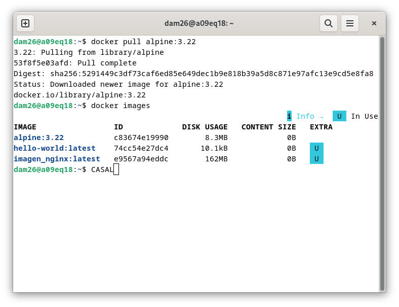
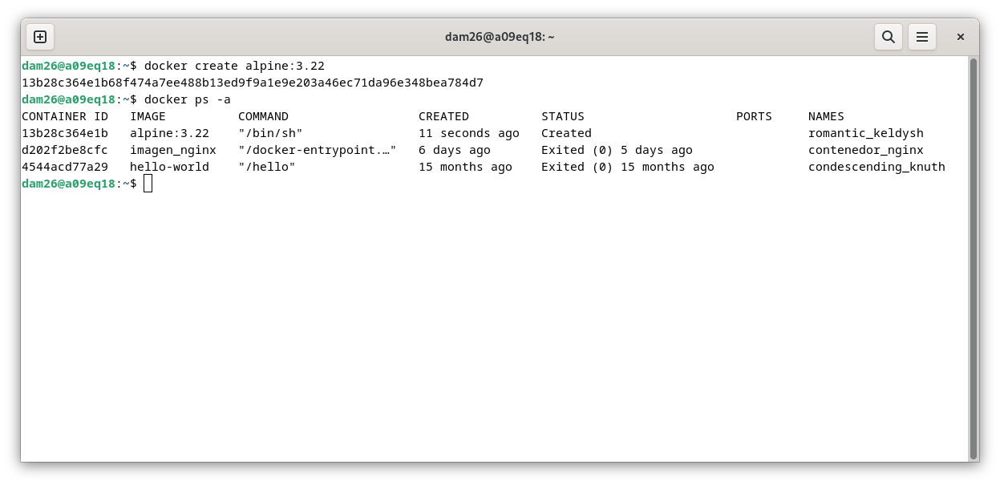
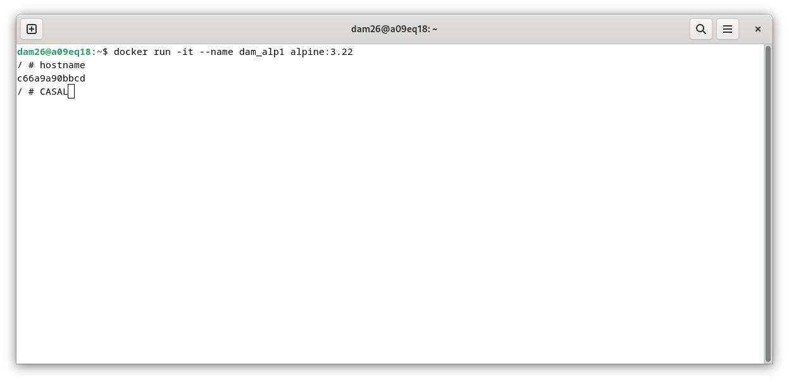
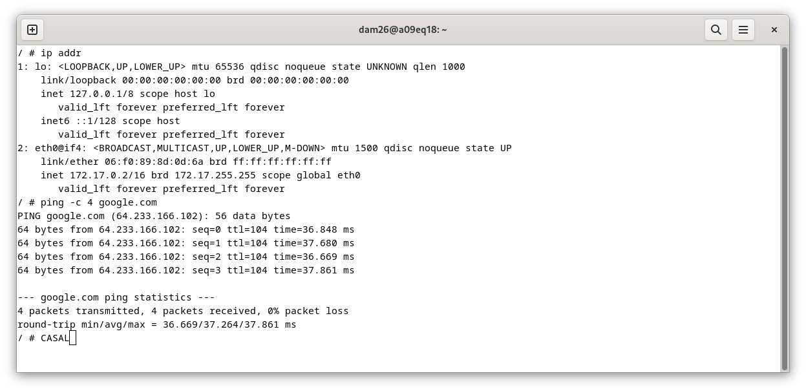
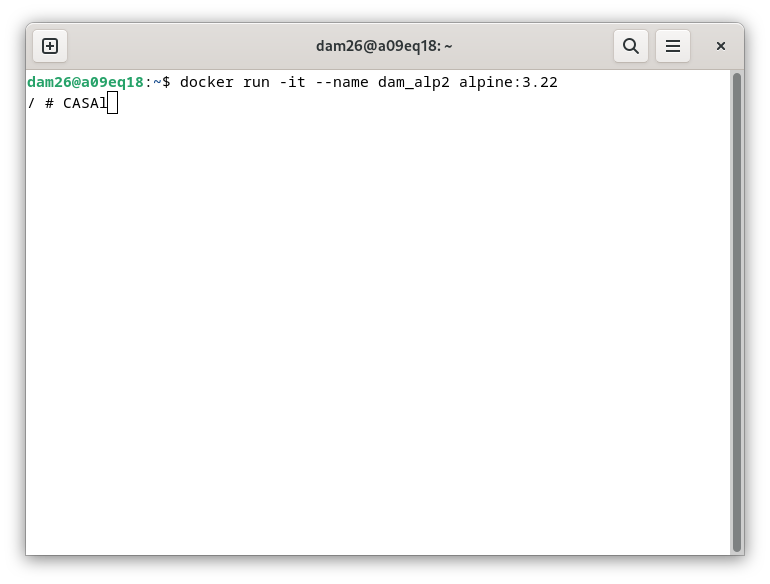
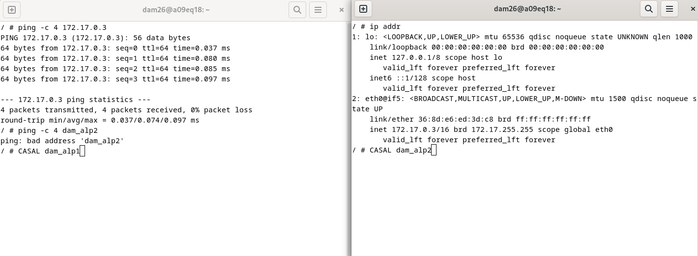
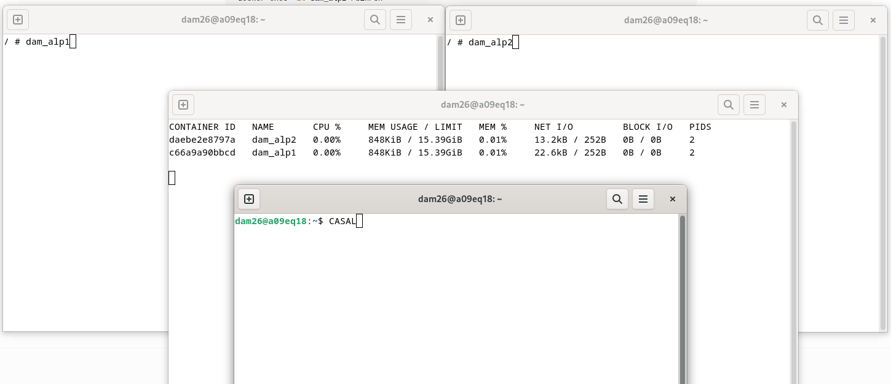
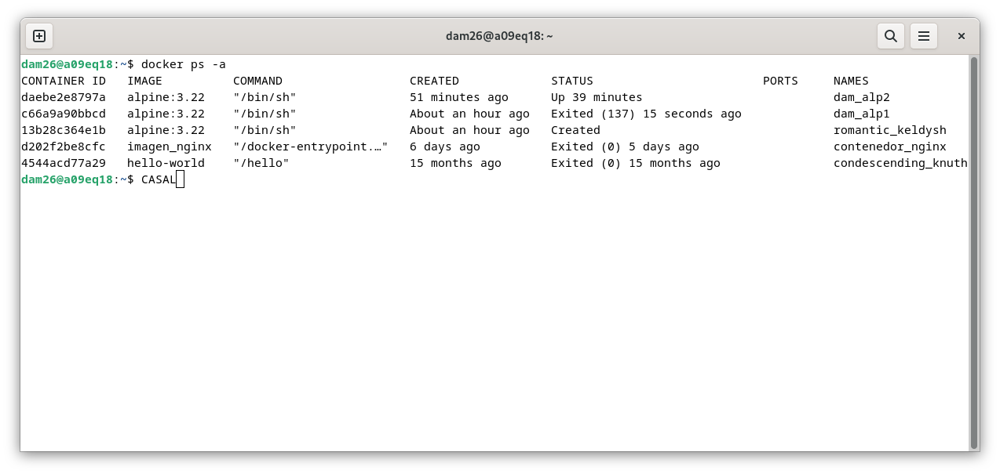
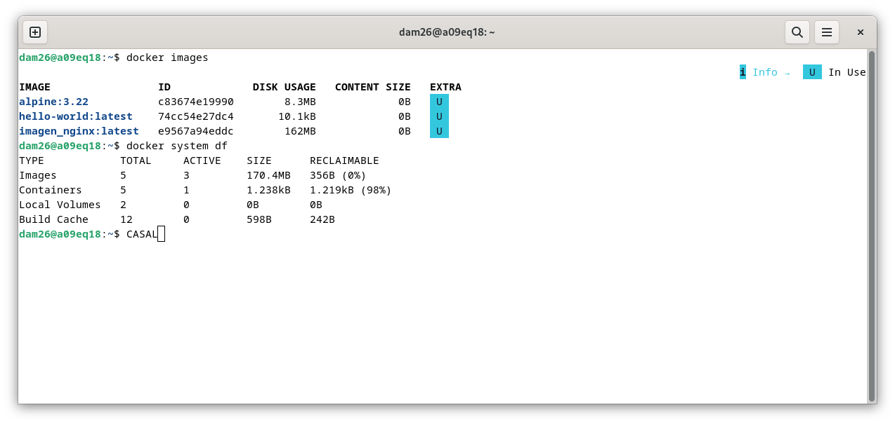
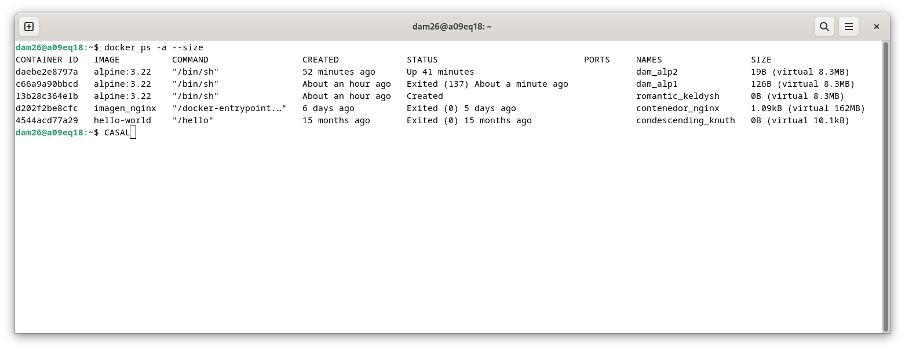

# 🐳 Práctica Docker - Alpine (`SXE_03_CASAL`)

Práctica de introducción a **Docker** utilizando la imagen ligera de **Alpine Linux** (versión 3.22), abarcando desde la descarga de imágenes hasta la gestión de contenedores, redes y recursos.

---

## 📋 Tabla de Contenidos
1. [Descarga de la imagen Alpine](#1-descarga-de-la-imagen-alpine)
2. [Creación de un contenedor sin nombre](#2-creación-de-un-contenedor-sin-nombre)
3. [Creación y ejecución de `dam_alp1`](#3-creación-de-dam_alp1)
4. [IP y conexión a Internet](#4-ip-y-conexión-a-internet)
5. [Comunicación entre contenedores](#5-comunicación-entre-contenedores)
6. [Consumo de memoria](#6-consumo-de-memoria)
7. [Salida del contenedor](#7-salida-del-contenedor)
8. [Espacio ocupado y almacenamiento](#8-espacio-ocupado)

---

## 1. Descarga de la imagen Alpine

Se descarga la versión `3.22` oficial de Alpine desde Docker Hub y se verifica su correcta descarga:

```bash
docker pull alpine:3.22
```
```bash
docker images
```

---

## 2. Creación de un contenedor sin nombre

Se crea un contenedor basándose en la imagen sin arrancarlo inmediatamente:

```bash
docker create alpine:3.22
```

Para comprobar su estado actual:

```bash
docker ps -a
```

> **Nota:** El contenedor queda en estado `Created`. Como no se ha especificado un nombre mediante la opción `--name`, Docker le asigna un identificador y un nombre aleatorios automáticamente.




¿En qué estado queda?

Queda en:
```
Created
```
Porque lo hemos creado pero no lo hemos arrancado.

¿Qué nombre le ha puesto Docker?

En la columna NAMES aparecerá un nombre generado aleatoriamente,por que no fue especificado con `--name` por ejemplo:
```
romantic_kedlysh
```

Cada vez será diferente.

---


## 3. Creación de `dam_alp1`

Se crea y arranca un nuevo contenedor de forma interactiva:

```bash
docker run -it --name dam_alp1 alpine:3.22
```



### ⚙️ Explicación de opciones:
* `-i` (interactive): Mantiene abierta la entrada estándar (`STDIN`).
* `-t` (tty): Asigna una pseudo-terminal interactiva.
* `--name dam_alp1`: Establece un nombre personalizado para identificar fácilmente el contenedor.

---

## 4. IP y conexión a Internet
Una vez dentro del contenedor interactivo, verificamos la configuración de red y la salida al exterior:

```bash
ip addr
ping -c 4 google.com
```



* **Resultado:** El contenedor dispone de una dirección IP propia dentro de la red del host y tiene total conectividad con Internet.

---

## 5. Comunicación entre contenedores

Para comprobar la comunicación en red, abrimos otra terminal y creamos un segundo contenedor (`dam_alp2`):

```bash
docker run -it --name dam_alp2 alpine:3.22
```



Desde `dam_alp1`, intentamos comunicarnos con `dam_alp2` tanto por su dirección IP como por su nombre:

```bash
ping -c 4 172.17.0.3
ping -c 4 dam_alp2
```



* **IP:** La comunicación por IP funciona correctamente porque ambos contenedores están conectados a la misma red (`bridge` por defecto).
* **Nombre:** La comunicación por nombre no funciona por defecto, ya que Docker no proporciona resolución DNS automática entre contenedores en la red bridge por defecto a menos que se creen redes personalizadas (user-defined networks).

---

## 6. Consumo de memoria

Para monitorizar el uso de recursos en tiempo real de los contenedores activos:

```bash
docker stats --no-stream
```

Este comando muestra una instantánea del consumo de CPU, límite y uso de memoria de cada contenedor.



---

## 7. Salida del contenedor

Para finalizar la sesión interactiva y salir del contenedor:

```bash
exit
```

Al ejecutarlo, la shell termina y el contenedor pasa automáticamente al estado `Exited`. Podemos comprobarlo listando todos los contenedores:

```bash
docker ps -a
```

> 💡 **Recordatorio:** Los contenedores detenidos no aparecen en un `docker ps` estándar; es obligatorio añadir el flag `-a` (`--all`).



---

## 8. Espacio ocupado

Para consultar el espacio total utilizado por los diferentes elementos de Docker en el sistema:

```bash
docker system df
```



También es posible consultar el tamaño específico ocupado por los contenedores añadiendo el modificador `--size`:

```bash
docker ps -a --size
```



> **Diferencia clave:** Las imágenes y los contenedores son elementos distintos. La imagen `alpine:3.22` actúa como un sistema de archivos de solo lectura base, mientras que cada contenedor añade una capa fina de escritura propia sobre ella para almacenar los cambios durante su ejecución.